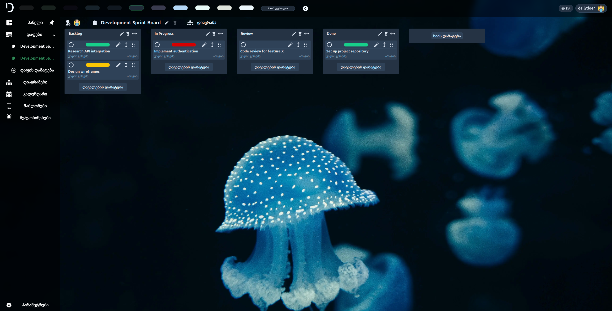

# DailyDoer – Task Management App

DailyDoer is a modern, collaborative task management web application built with React, TypeScript, and a rich set of UI libraries. It supports real-time collaboration, customizable themes, notifications, and advanced user management.

---

## Features

- **User Authentication**
  - Email/password login & registration
  - Google OAuth sign-in
  - Password reset and confirmation
- **Boards, Lists, and Tasks**
  - Create multiple boards, each with customizable lists and tasks
  - Drag & drop tasks between lists (DND-Kit & SortableJS)
  - Task priorities, due dates, and user assignment
  - Real-time updates via WebSockets
- **MindMap Visualization**
  - Visualize board structure and relationships as a mind map
  - Drag & drop nodes (tasks, lists, boards)
  - Edit, connect, and organize tasks visually
  - Save node positions per board
  - Real-time updates
- **User & Member Management**
  - Invite users to boards, set roles (owner, admin, member)
  - Edit board names, remove users, leave boards
- **Customizable Themes**
  - Multiple built-in dark/light themes
  - Full custom theme editor (colors, backgrounds)
  - Per-board background images (with permissions)
- **Notifications**
  - In-app and push notifications for board events, invitations, reminders
  - Mark as read, delete single/all notifications
- **Calendar View**
  - Yearly calendar with task due date highlights
  - View all tasks due on a selected day
- **Profile & Settings**
  - Update profile info, profile picture (upload or avatar)
  - Change password (with validation)
  - Delete account (with confirmation)
  - Language selection (English/Georgian)
- **Templates**
  - Create new boards from pre-defined templates

---

## Tech Stack

- **Frontend:** React, TypeScript, Vite
- **UI Libraries:** Material-UI, Ant Design, React Icons, React Loading Skeleton, React Spinners
- **State & Routing:** React Hooks, React Router
- **Drag & Drop:** DND-Kit, SortableJS
- **Networking:** Axios, WebSockets
- **Other:** Service Workers for push notifications

---

## Getting Started

### Prerequisites

- Node.js (v16+ recommended)
- npm or yarn

### Installation

1. **Clone the repository:**

   ```bash
   git clone https://github.com/Guram12/taskmainder_front.git
   cd taskminder
   ```

2. **Install dependencies:**

   ```bash
   npm install
   # or
   yarn install
   ```

3. **Environment Variables:**
   - Copy `.env.example` to `.env` and set your API base URL and Google OAuth client ID.

  ```
  VITE_GOOGLE_CLIENT_ID=<Your google client id>
  ```

4. **Start the development server:**
   ```bash
   npm run dev
   # or
   yarn dev
   ```

5. **Open in your browser:**
   ```
   http://localhost:5173
   ```

---

## Sitemap

### Public Routes (Unauthenticated)
- **`/`** - Intro / Landing page (showcase, marketing, language selection, Google sign-in)
- **`/login`** - Login page with email/password and Google OAuth
- **`/register`** - User registration with email verification
- **`/password-reset`** - Password reset request form
- **`/password-reset-confirm/:uid/:token`** - Password reset confirmation
- **`/finish-profile`** - Complete Google OAuth profile setup
- **`/error`** - Error page for authentication/invitation failures

### Protected Routes (Authenticated)
- **`/mainpage`** - Main application dashboard with sidebar navigation

#### Main Application Components (accessible via sidebar)
- **Boards** - Default view, board and task management
  - Board creation and management
  - Drag & drop task organization
  - List management
  - Task creation, editing, and assignment
  - Member management and invitations
  - Board background customization
- **MindMap** - Visual board and task mapping
  - Interactive mind map of boards, lists, and tasks
  - Drag & drop node organization
  - Edit tasks/lists/board names directly on the map
  - Real-time updates and position saving
- **Calendar** - Calendar view of tasks and due dates
  - Yearly calendar with task highlights
  - Daily task overview
  - Due date management
- **Templates** - Pre-built board templates
  - Template selection and board creation
  - Quick project setup
- **Notifications** - Notification center
  - Real-time notifications
  - Board invitations and updates
  - Task reminders and due dates
- **Settings** - User preferences and account management
  - Profile information update
  - Profile picture management
  - Password change
  - Custom theme editor
  - Board background management
  - Account deletion
  - Language preferences (English/Georgian)

### Component Hierarchy
```
App.tsx
├── Header.tsx (Global navigation and user menu)
├── MainPage.tsx (Main dashboard container)
│   ├── SideBar.tsx (Navigation sidebar)
│   ├── Boards/ (Board management components)
│   │   ├── Boards.tsx
│   │   ├── Lists.tsx
│   │   ├── Tasks.tsx
│   │   ├── TaskUpdateModal.tsx
│   │   ├── ConfirmationDialog.tsx
│   │   └── Skeleton components for loading states
│   ├── Calendar.tsx
│   ├── Templates.tsx
│   ├── Notification.tsx
│   ├── Settings.tsx
│   │   ├── ProfilePictureUpdate.tsx
│   │   ├── Profile_Info_update.tsx
│   │   ├── ChangePassword.tsx
│   │   ├── CustomTheme.tsx
│   │   ├── DeleteAccount.tsx
│   │   └── ChangeNotification.tsx
│   ├── Members.tsx
│   ├── NoBoards.tsx (Empty state)
│   └── ErrorPage.tsx
└── Auth Components (Login, Register, etc.)
```

---

## Project Structure

```
src/

├── assets/                    # Images, icons, logos, and wallpapers
├── auth/                      # Authentication components
│   ├── FinishGoogleSignIn.tsx
│   ├── GoogleSignIn.tsx
│   ├── login.tsx
│   ├── PasswordResetConfirm.tsx
│   ├── PasswordReset.tsx
│   └── register.tsx
├── components/                # Main application components
│   ├── Boards/               # Board, List, Task management
│   │   ├── Boards.tsx
│   │   ├── ConfirmationDialog.tsx
│   │   ├── Lists.tsx
│   │   ├── Tasks.tsx
│   │   ├── TaskUpdateModal.tsx
│   │   ├── SkeletonBoardName.tsx
│   │   ├── SkeletonEachTask.tsx
│   │   ├── SkeletonEachUser.tsx
│   │   ├── SkeletonListLoader.tsx
│   │   ├── SkeletonLoader.tsx
│   │   ├── SkeletonMember.tsx
│   │   ├── SkeletonNotification.tsx
│   │   └── SkeletonUserInfo.tsx
│   ├── settings/             # User settings and profile
│   │   ├── ChangePassword.tsx
│   │   ├── CustomTheme.tsx
│   │   ├── DeleteAccount.tsx
│   │   ├── Profile_Info_update.tsx
│   │   ├── ProfilePictureUpdate.tsx
│   │   └── ChangeNotification.tsx
│   ├── Calendar.tsx
│   ├── ErrorPage.tsx
│   ├── LogoComponent.tsx
│   ├── MainPage.tsx
│   ├── Members.tsx
│   ├── NoBoards.tsx
│   ├── Notification.tsx
│   ├── Settings.tsx
│   ├── SideBar.tsx
│   └── Templates.tsx
├── header/                   # Header bar components
│   ├── Header.css
│   └── Header.tsx
├── styles/                   # CSS files
│   ├── Board Styles/        # Board-related styles
│   ├── settings/            # Settings-related styles
│   ├── # other component styles
└── utils/                        # Utilities and configurations
    ├── axiosinstance.ts      # Axios HTTP client configuration
    ├── CustomTheme.ts        # Custom theme creation and management
    ├── data.json            # Static data for user timezone
    ├── i18n.ts              # Internationalization (English/Georgian)
    ├── interface.ts         # TypeScript interfaces and types
    ├── SetRandomColor.ts    # Random color generation utilities
    ├── supbscription.ts     # Push notification subscription handling
    ├── Templates.ts         # Board templates 
    ├── theme.ts             # Theme configuration and presets
    └── URLS.ts              # API endpoint URLs
```

---

## Customization

- **Themes:** Change theme from the header or create your own in Settings.
- **Languages:** Switch between English and Georgian from the header.
- **Board Backgrounds:** Owners/admins can set custom images per board.

---


## Credits

- Built with [React](https://react.dev/), [Vite](https://vite.dev/), [Material-UI](https://mui.com/), [Ant Design](https://ant.design/), [DND-Kit](https://dndkit.com/), [SortableJS](https://sortablejs.github.io/Sortable/), and more.
- Icons by [React Icons](https://react-icons.github.io/react-icons/).

---

## Screenshots

- Board voew with background



---
